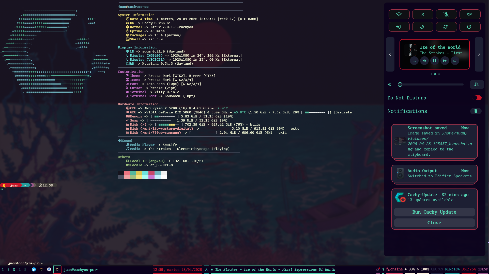
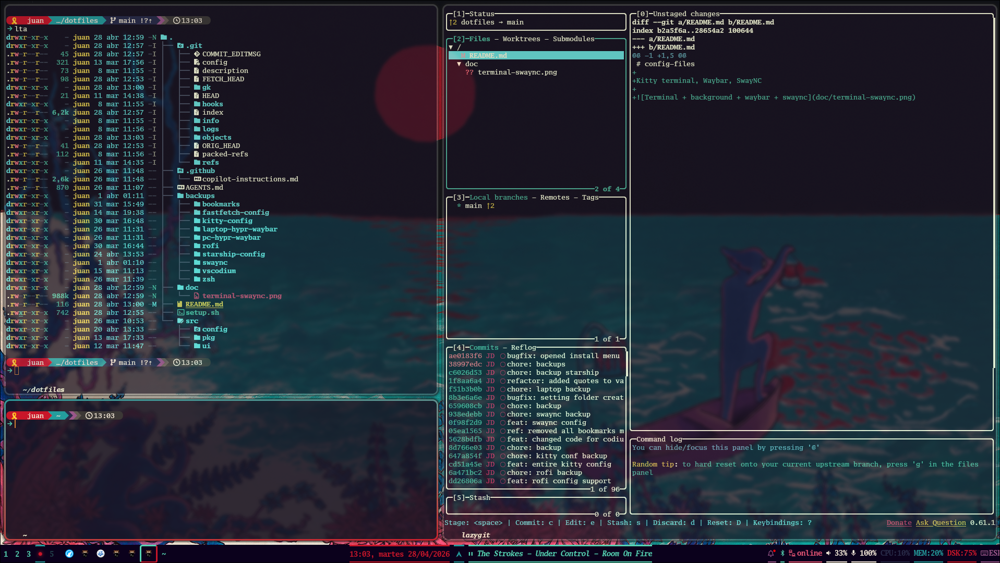
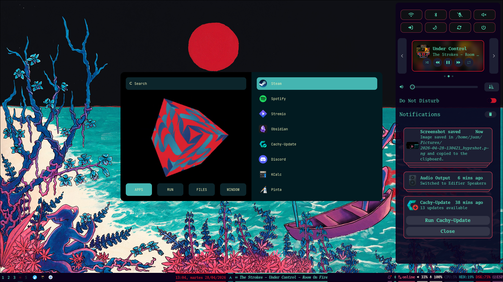

# My Dotfiles

Personal dotfiles and machine setup. Provides an interactive script to install software, apply saved configs, and back up current configs.

## Requirements

- Arch Linux (primary support) — `apt` and `dnf` distros are partially supported for package installs
- `yay` or `paru` for AUR packages (optional but recommended)
- `bash` 4.3+

## Getting started

Clone the repo and run the setup script:

```bash
git clone https://github.com/juandiazan/dotfiles.git
cd ~/dotfiles
./setup.sh
```

## What the script does

The interactive menu has three options:

**1 — Install software**
Browse packages grouped by category (Apps, Dev Tools, TUIs, Customization), toggle individual items on/off, and install the selection. On Arch, packages are tried via `pacman` first and fall back to your AUR helper automatically.

**2 — Apply configurations**
Copies saved config files from this repo into their correct locations on your system (e.g. `~/.config/kitty/`, `~/.zshrc`, etc.).

**3 — Backup configurations**
Copies your current live config files back into this repo so you can commit and version them.

## Adding your own packages or configs

See `CLAUDE.md` for the exact steps — it's kept up to date with the project structure.

---

## Some example pictures

### Empty BG


### Kitty terminal, Waybar, SwayNC



### Kitty terminal with Lazygit, Waybar



### Rofi and SwayNC


